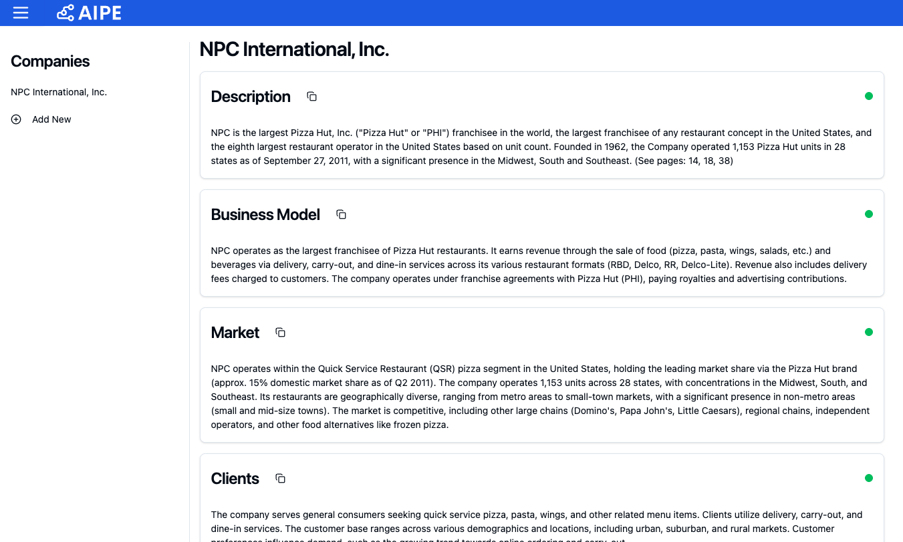
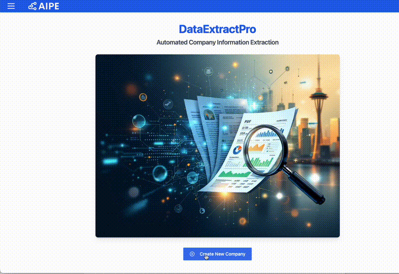

# DataExtractPro

DataExtractPro is an automated tool for extracting structured information from company documents (such as annual reports, CIMs, etc.) using Google's Gemini AI model.

<div align="center">
  
</div>

## Demo

<div align="center">
  
</div>

📺 [Watch Demo on YouTube](https://youtu.be/dRaBDlTZ-aI)

## Setup

### Prerequisites

- Python 3.8 or higher
- Poetry (Python package manager)
- Google API key for Gemini AI

### Installation

1. Clone the repository:
```bash
git clone <repository-url>
cd data_extractor
```

2. Install dependencies using Poetry:
```bash
poetry install
```

3. Create a `.env` file in the root directory with your Google API key:
```bash
echo "GOOGLE_API_KEY=your_api_key_here" > .env
```

Replace `your_api_key_here` with your actual Google API key. You can obtain one from the [Google AI Studio](https://makersuite.google.com/app/apikey).

### Starting the Application

1. Activate the Poetry environment:
```bash
poetry shell
```

2. Run the application:
```bash
python main.py
```

3. Open your browser and navigate to: 
```
http://localhost:8001
```
You should see the DataExtractPro homepage with:
- The application logo
- A "Create New Company" button
- A sidebar menu for navigation (that opens if you click on the menu top left)
- The main content area

If you can't access the application:
- Verify that the server started successfully in your terminal
- Check if port 8001 is available (you can modify the port in main.py if needed)
- Ensure you're using a modern web browser (Chrome, Firefox, Safari, or Edge)

## User Manual

### Adding a New Company

There are two ways to add a new company:

1. From the homepage:
   - Click the "Create New Company" button in the center of the page

2. From anywhere in the application:
   - Click the "Add New" button in the sidebar menu

### Uploading Documents

1. On the new company page:
   - Drag and drop your PDF file into the upload zone, or click to select a file
   - Supported files: Annual reports, CIMs, or similar company documents in PDF format
   - Once uploaded, click "Start Extraction" to begin the process

### Viewing Company Information

The extracted information is organized into several sections:
- Description
- Business Model
- Market
- Clients
- Products
- Top Management
- Financial Data

Each section includes:
- The extracted information
- Page references where the information was found (not all fields currently)
- A copy button to easily copy the content

### Financial Data

The financial section displays a table with:
- Revenue
- EBITDA
- Margin
- Debt

Years marked with "E" indicate forecast data.

### Copying Data

- Each section has a copy button (📋) in its header
- Financial data is copied in a format compatible with Excel

### Navigation

- Use the sidebar menu to switch between companies
- Click the logo to return to the homepage
- The sidebar can be toggled using the menu button in the top-left corner

## Technical Notes

- The application automatically creates necessary data directories
- Extracted data is stored in the `data` directory (automatically created)
- The application uses Google's Gemini AI model for extraction
- All sensitive data and directories are excluded from git tracking

## Troubleshooting

If you encounter issues:

1. Verify your Google API key is correct in the `.env` file
2. Ensure all dependencies are installed (`poetry install`)
3. Check that your PDF is readable and not password-protected
4. Verify you have sufficient permissions in the application directory

## Support

For additional support or to report issues, please contact info@aipetech.com.